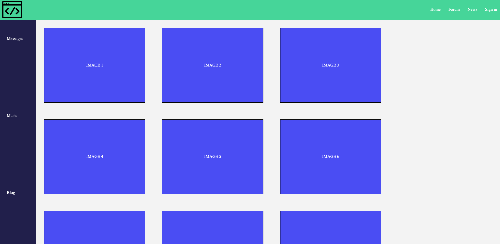
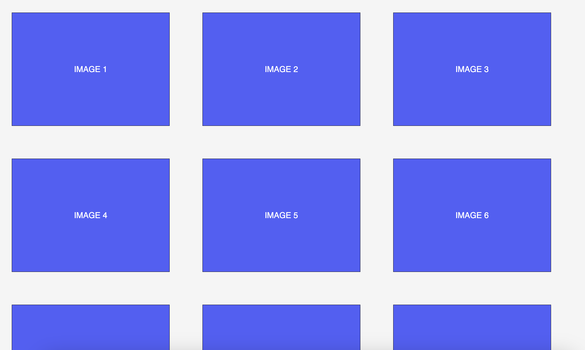
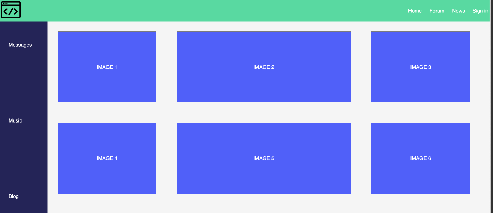

# Flexible Mock Magic

**GOAL**: You have been tasked with tasked with designing a mockup of a webpage for a new company that wants to create a social media platform for coders. They have provided the following mockup for their desired output.

## Directions

Use your knowledge of flexboxes to complete the following design tasks. Some will require nested flexboxes, so it may help to do a sketch of your desired layout before you begin coding! 

### Footer

Create a ruleset for the `<footer>` element to match the image below. The images should be evenly spaced in a single row.

### Navigation Bar

The `nav class="navbar` contains an image and a `ul` as children. Design a nested flexbox that places the image at one end of the flexbox and the list elements in a row on the other end.

### Sidebar and Main Content

The sidebar and main content area are all contained within the `main class="flex-main"` that should contain two flexboxes.

The sidebar should contains all the elements evenly spaced and stacked on top of one another like the image shown below.

The main content area should fill the remaining space with the image containers. If the image containers do not all fit inside the flexbox, they should go to a new row like the image below. 

## Done Early? Try These Stretch Exercises 🚀

Currently, the image containers aren't really filling the entire space. Can you use `flex-grow` to have the middle child element fill the entire remaining space

Explore the [CSS Tricks Documentation](https://css-tricks.com/snippets/css/a-guide-to-flexbox/) 🔍 and incorporate the following into your design:
- `gap`
- `row-gap`
- `column-gap`
- `order`
- `flex-shrink`
- `flex-basis`
- `flex`